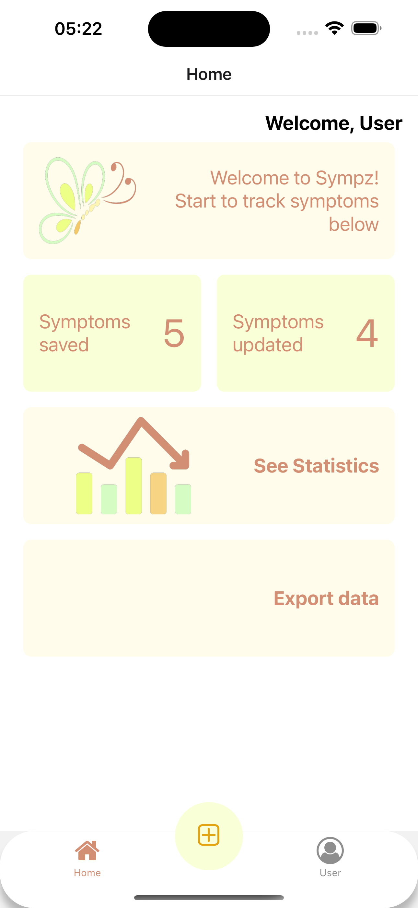
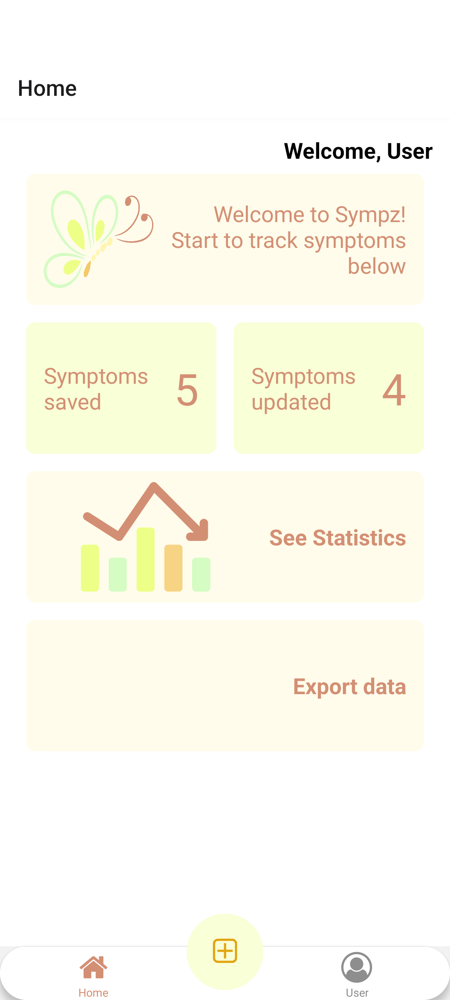
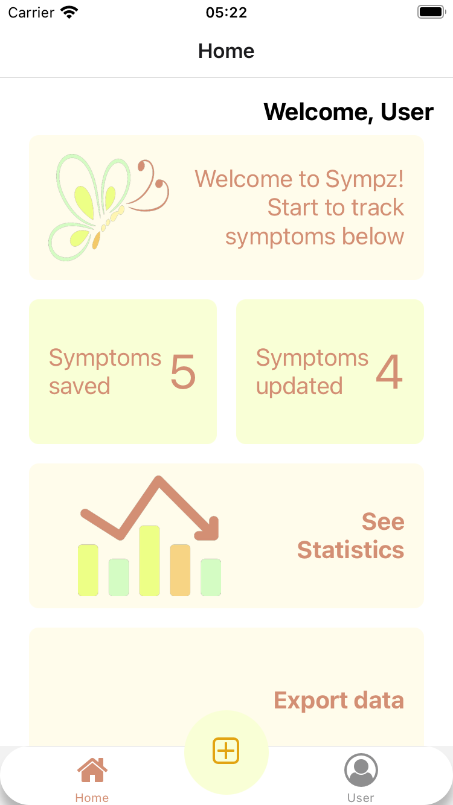
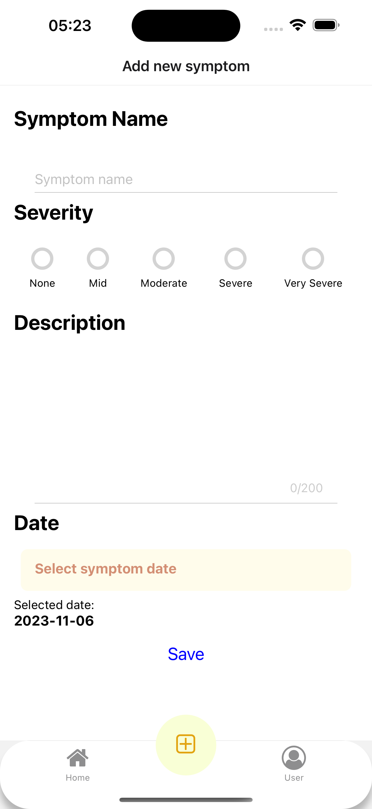
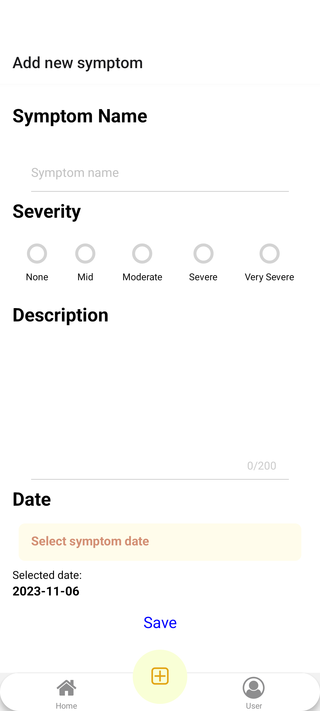
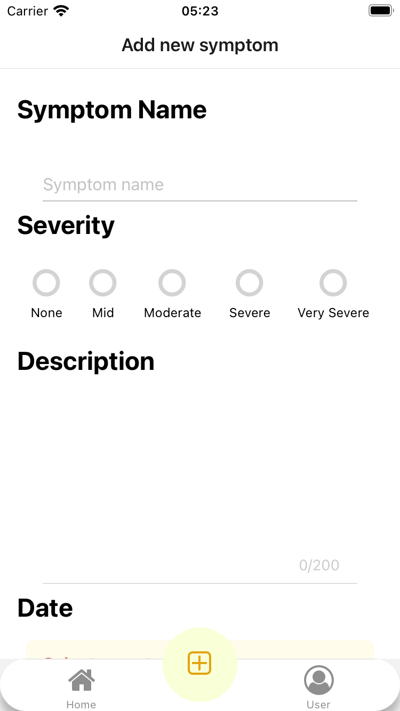

# Sympz

Use 🦋Sympz🦋 to make symptom tracking effortless and insightful. Whether you're managing a chronic condition, recovering from an illness, or simply keeping an eye on your daily health, 🦋Sympz🦋 is here to help.


## 📸 Screenshots Home 📸

| | | |
|---|---|---|
|  |  |  |
| iOS With DynamicIsland | Android | iOS Small device |

## 📸 Screenshots Add Symptom 📸
| | | |
|---|---|---|
|  |  |  |
| iOS With DynamicIsland | Android | iOS Small device |


##  🛠Tech stack 🛠
- React native
- Expo
- TypeScript
- Async storage
- DateTimePicker
## ✨ Features ✨

- Create Symptoms with details like Date, severity, and custom description.
- Review your Symptoms


##  🔜 Roadmap

- Edit and delete symptoms 
- Statistics 
- Login
- Export data


## Run Locally

Clone the project

```bash
  git clone https://github.com/betanyeli/simpli-note.git
```

Go to the project directory

```bash
  cd sympz-app
```

Install dependencies

```bash
  yarn install
```

Start the server

```bash
  yarn start
```

## Running Tests

To run tests, run the following command

```bash
  yarn test
```

Or run linter

```bash
  yarn lint
```


## Author

Develop with love by 💕[@Beta](https://www.github.com/betanyeli)💕


## Feedback

🙉Your feedback is my salary🙉. If you have any comments, suggestions, let me know 🪐
